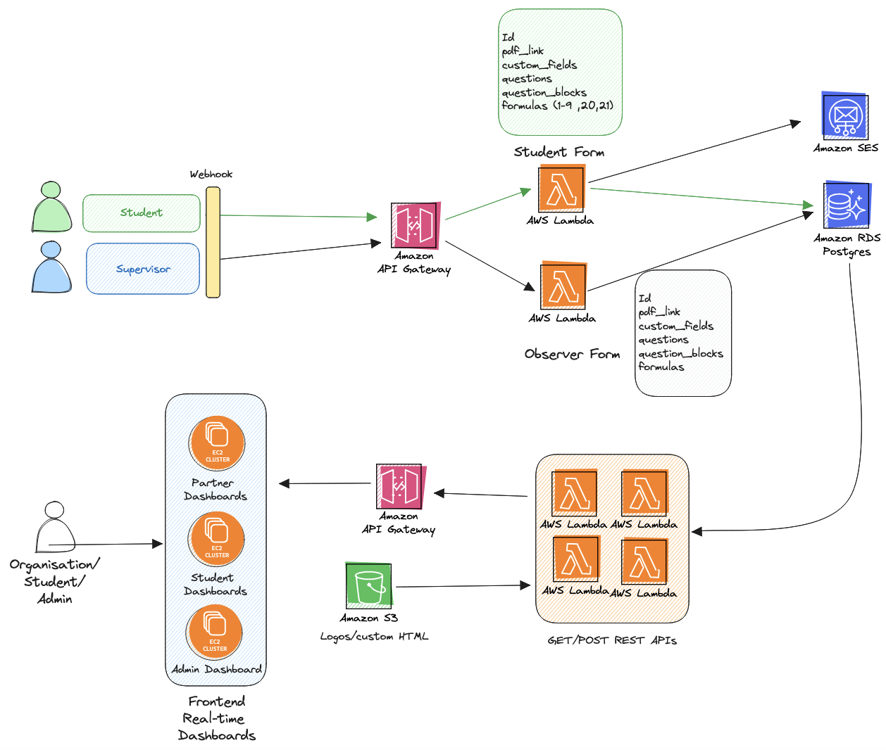
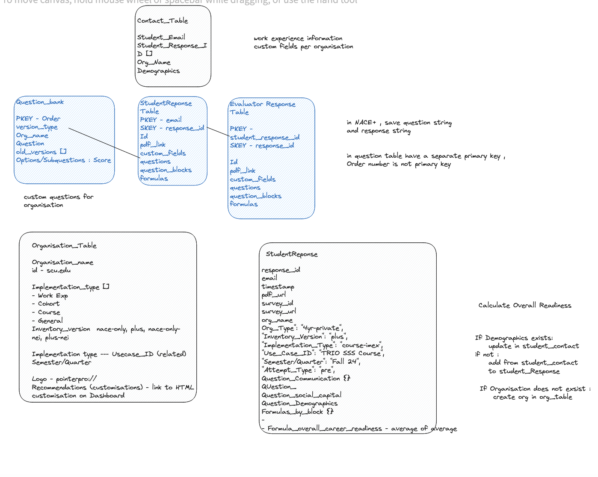

# Student Survey Project

## Overview
The Student Survey Project is designed to collect and analyze feedback from students and supervisors using a robust cloud-based solution. This project leverages Amazon Web Services (AWS) to handle data intake, processing, and visualization, providing insights into student experiences and performance.

## Architecture
Below is the architecture diagram illustrating how different AWS services are integrated into the project:



The architecture utilizes several AWS services to streamline the workflow:
- **Amazon API Gateway** manages incoming requests from various forms, routing them to the appropriate Python-based AWS Lambda functions.
- **AWS Lambda** (Python) processes these requests, handling form logic and data manipulation.
- **Amazon RDS (PostgreSQL)** serves as the database backend, storing form responses and related data.
- **Amazon SES** is used for sending emails, enabling notifications and communications.
- **Amazon S3** hosts static resources such as logos and custom HTML for the dashboard.
- **Real-time Dashboards** are implemented using custom frontend technology, displaying data fetched via API Gateway from Lambda functions.

## Database Schema
Here's the schema diagram showing the database layout:



The database schema includes multiple tables designed to handle various aspects of data storage:
- **Contact_Table**: Stores contact information and demographics.
- **Question_Bank**: Holds questions available for inclusion in surveys.
- **StudentResponse** and **EvaluatorResponse**: Capture responses from students and evaluators.
- **Organisation_Table**: Contains information about participating organizations and their specific survey settings.
- **Student_Table**: Stores unique IDs, names, last names, emails of students, and their associated response IDs.

## Getting Started

### Prerequisites
- AWS Account
- Python 3.x
- PostgreSQL
- pip for Python package management

### Installation
1. Clone the repository:
   ```bash
   git clone <repository-url>
   ```
2. Install Python dependencies within a package directory (this directory will be zipped with your Lambda function):
   ```bash
   pip install -r requirements.txt -t ./package
   ```
3. Prepare your deployment package:
   ```bash
   cd package
   zip -r ../myfunction.zip .
   cd ..
   zip -g myfunction.zip lambda_function.py
   ```

### Configuration
- Update the `config.json` or equivalent configuration file with your AWS service details and database connection settings.
- Ensure environment variables for AWS credentials and database configurations are set up correctly.

### Deployment
- Deploy the function to AWS Lambda using the AWS CLI:
  ```bash
  aws lambda update-function-code --function-name myFunction --zip-file fileb://myfunction.zip
  ```

## Contributing
Contributions are welcome! Please create a pull request with your proposed changes.

## License
This project is licensed under the MIT License - see the LICENSE file for details.
